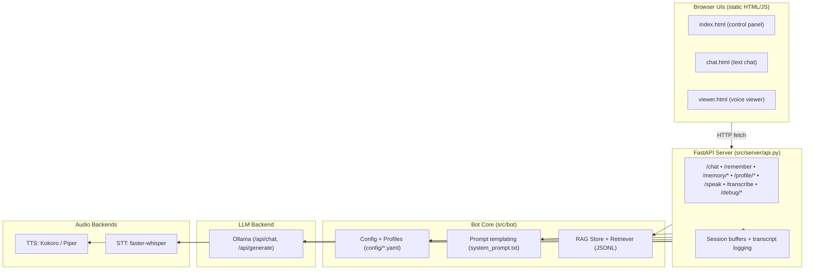

# Jarvis AI Framework – Project Overview

## ✅ Current Features
- **Profiles / Personas**
  - Configurable via `config/profiles/*.yaml` (e.g. Jarvis, Patricia, Patrick).  
  - Each profile defines identity (name, gender, age, language, timezone), personality style, and boundaries.  

- **LLM Integration**
  - Primary backend: **Ollama** (via `/api/generate` and `/api/chat`).  
  - Works with models like `dolphin-mistral-nemo`.  
  - System prompt templating (`system_prompt.txt`) with persona injection.  
  - Current date/time injected into Ollama payloads.  
  - Debug endpoint `/debug/last_ollama_payload` shows raw requests.  

- **Memory (RAG)**
  - Local vector-like store (`data/rag/store.jsonl`).  
  - Short-term buffer (`history_max_messages`).  
  - Long-term retrieval with tags (#global, #session-summary, …).  
  - Import/export buttons in web UI.  

- **Voice**
  - **TTS**: Piper (local voices in `data/piper`).  
  - **STT**: Faster-whisper, CUDA enabled (configurable via `device: cpu/cuda`).  
  - Both integrated into server endpoints `/speak` and `/transcribe`.  

- **Web UIs**
  - `index.html`: control panel (profiles, TTS/STT toggle, memory tools).  
  - `viewer.html`: voice-first interface (auto-listening, idle nudges, mute/listen toggles).  
  - `chat.html`: text-first interface (chat layout with emoji picker, like ChatGPT).  

- **Debugging**
  - `/debug/context`: active profile, session, last turns, RAG notes, identity info.  
  - `/debug/last_ollama_payload`: full JSON sent to Ollama.  

---

## 🗺️ Visual Architecture Diagram


---

## 🚀 Future Enhancements (Ideas)
1. **Backend Flexibility**
   - Add support for LM Studio (API-compatible with OpenAI spec).  
   - Add support for OpenAI / ChatGPT API.  
   - Unified abstraction: switch between Ollama, LM Studio, ChatGPT seamlessly.

2. **/Google Integration**
   - Let LLM emit `/google query` if it needs live data.  
   - Backend fetches search results and feeds them back into the model.  
   - Debug endpoint to trace when external knowledge was pulled.

3. **UI Enhancements**
   - In `chat.html`: message history persists in browser localStorage.  
   - Rich formatting (markdown, images, code blocks).  
   - In `viewer.html`: VAD-style listening (wake word instead of always-on).  

4. **Memory Management**
   - Add buttons for "summarize session" and "clear session memory".  
   - Option to automatically summarize every N turns into RAG store.  

---

## 🛠 Install & Run (Quickstart)
1. Clone repo and create environment:  
   ```sh
   git clone https://github.com/<yourrepo>/ai-chatbot.git
   cd ai-chatbot
   conda create -n ai-chatbot python=3.11
   conda activate ai-chatbot
   pip install -r requirements.txt
   ```

2. Install CUDA-enabled faster-whisper:  
   ```sh
   pip install faster-whisper
   conda install -c nvidia cudnn=9.1 cudatoolkit=12.4
   ```

3. Install Piper voices:  
   Place `.onnx` + `.onnx.json` in `data/piper`.

4. Run server:  
   ```sh
   uvicorn server.api:app --reload
   ```

5. Open web UI:  
   - [http://localhost:8000/static/index.html](http://localhost:8000/static/index.html)

---

## 📄 Notes
- Default persona = **Jarvis** (intelligent, witty, helpful).  
- Patricia/Patrick profiles remain private.  
- Current project is designed for **local-first AI**, but architecture is flexible enough for cloud (ChatGPT API) integration later.  
